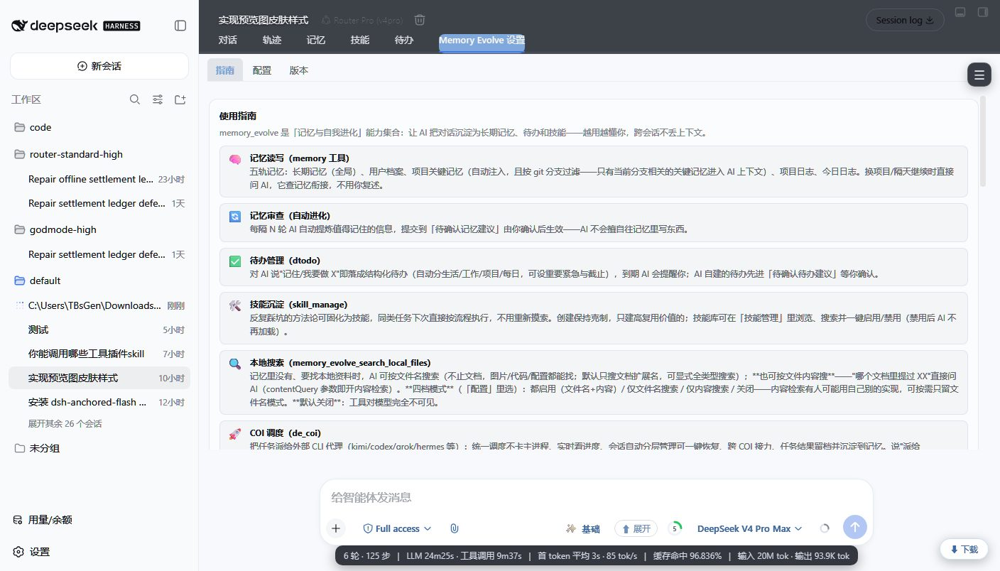
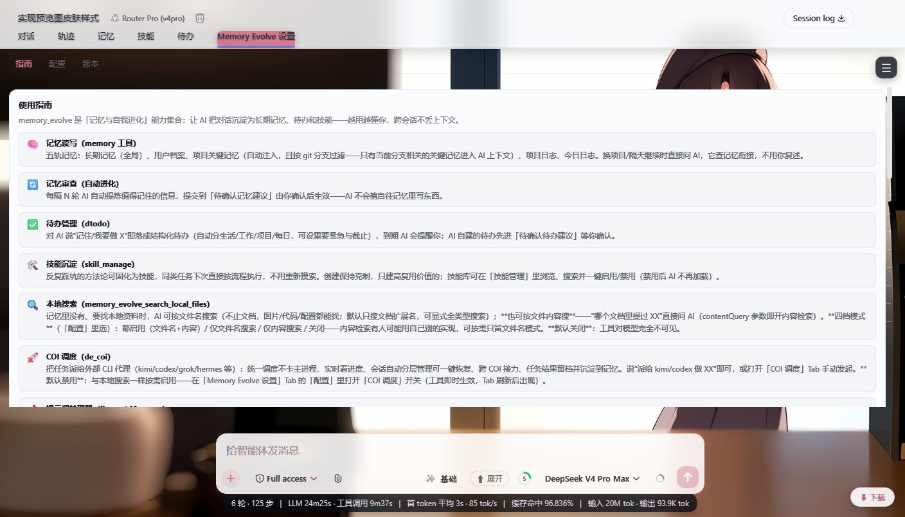
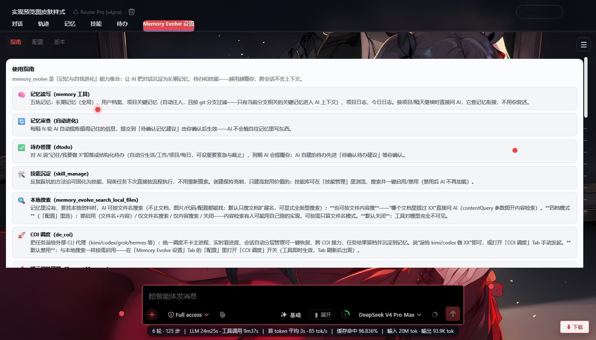
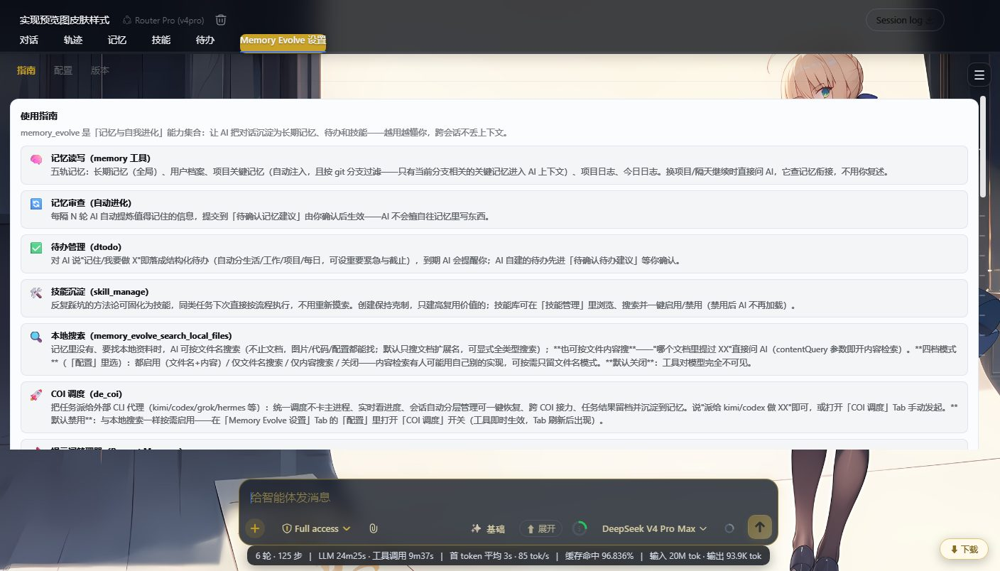

# dsh-anime-skins


DSH 动漫皮肤管理器：一套客户端插件，提供 6 种皮肤，并实现预览 HTML 的完整 UI 布局：浮动 ☰ 菜单、会话列表分组子菜单、皮肤切换弹窗、主题化输入区/下载面板/命令菜单等。

> ⚠️ 这是一个 **plain cordis 插件（非 bundle）**，不是 `dsh.bundle` 插件。
> 请使用 `dsh plugin --profile ... add` 安装为普通 cordis 依赖 + `cordis.patch.yml` 插入行；
> **不要**把它加入 `dsh.profile.bundles`，bundle 方式曾导致 DSH 启动失败（`code=1`）。

## 皮肤预览

| 经典 | 亚丝娜 | 明日香 |
| --- | --- | --- |
|  |  |  |

| 加藤惠 | 远坂凛 | 阿尔托莉雅 |
| --- | --- | --- |
|  |  |  |

## 功能

- 6 套皮肤：经典 / 亚丝娜 / 明日香 / 加藤惠 / 远坂凛 / 阿尔托莉雅
- 浮动 `☰` 菜单：会话列表（按工作区分组）、皮肤切换、打开原生设置
- 会话列表支持工作区展开/折叠，会话行右侧 `⋯` 四层菜单（打开/重命名/归档/删除）
- 回到底部主题按钮（按实际滚动容器定位）
- 皮肤选择持久化：cookie（host 级，跨随机端口重启恢复） + localStorage 兜底
- 主题适配：顶栏、输入条、下载胶囊/面板、加号命令菜单、触发按钮、模式标签、底部统计行等（仅作用于 DSH 原生 UI 与本插件自身 UI，不包含其它插件的功能）

## 要求

- DeepSeek Harness Desktop（DSH）
- 浏览器端客户端运行时（`@deepseek-ai/dsh-client-runtime`）
- 推荐 DSH 版本：`>= 0.1.0`

## 安装

推荐通过 `dsh plugin add` 安装为普通 cordis 插件：

```bash
# 从本地目录
dsh plugin --profile web add ./dsh-anime-skins

# 从 npm 包（发布后）
dsh plugin --profile web add dsh-anime-skins

# 从 GitHub（建议 pin commit）
dsh plugin --profile web add "github:ZRTBdSS/dsh-anime-skins#<commit-sha>"
```

安装后配置 HMR 应自动生效；若没有即时生效，重启一次 DSH Web 端。

## 卸载

```bash
dsh plugin --profile web remove dsh-anime-skins
```

如果之前是手动 patch 安装，删除 `cordis.patch.yml` 中对应的 `insert` 行：

```yaml
# 删除这段
- id: dsh-anime-skins
  name: dsh-anime-skins
  disabled: false
```

然后重启 DSH。

## 使用

1. 安装并重启后，右上角会出现浮动 `☰` 按钮。
2. 点击 `☰`：
   - **会话列表**：按工作区分组展示会话，点击工作区展开/折叠；右侧 `⋯` 可打开/重命名/归档/删除。
   - **皮肤切换**：打开皮肤选择弹窗，点击卡片即切换并自动保存。
   - **设置**：打开 DSH 原生设置窗口（居中显示）。
3. 会话滚动时，右下角会出现主题化“回到底部”按钮。

## 与本插件实际相关的其它插件情况

> 本插件只实现自己的皮肤/菜单/布局功能。下表只说明当前代码**实际做了什么**，不承诺“完整兼容”或提供其它插件自身的功能。

| 插件 | 本插件实际行为 |
| --- | --- |
| dsh-smooth-stream | 有 CSS 适配：`.dss-root`、`.dss-nr-*`、`.dss-dr-*` 会按皮肤透明化并配色。`dsh-asuna-bridge` 是独立插件，不属于本包；如需更完整的内层透明效果可自行安装 bridge。 |
| dsh-better-sidebar | 当前版本会隐藏其折叠浮层/面板（`.W-zNGW_*`），**不保留右侧展开区域**。如果你需要继续使用 better-sidebar，可能需要自行调整本插件的隐藏规则。 |
| dsh-usage-stats | 仅对 `.usg_*` 文字颜色做统一样式。由于本插件隐藏原生侧栏，其侧栏挂载点默认不可见；本插件**没有**实现“搬到底部统计行”的功能。 |
| 其它 UI 插件 | 未做专门适配；如果出现视觉冲突，建议停用对应插件。单个 UI 插件停用不会破坏 DSH 启动。 |

## 目录结构

```text
dsh-anime-skins/
├─ lib/
│  ├─ client.js        # 浏览器侧皮肤逻辑
│  ├─ index.js         # host 侧空插件入口
│  └─ index.d.ts       # 类型声明
├─ docs/
│  └─ images/          # 皮肤预览图
├─ .github/
│  ├─ workflows/       # CI 自动检查
│  └─ ISSUE_TEMPLATE/  # Issue 模板
├─ index.js
├─ package.json
├─ dsh.plugin.json
├─ cordis.patch.yml
├─ README.md
├─ CHANGELOG.md
├─ CONTRIBUTING.md
├─ SECURITY.md
└─ LICENSE
```

## 开发

```bash
npm run check    # node --check lib/index.js 与 lib/client.js
```

- `lib/index.js`：host 侧空插件入口
- `lib/client.js`：浏览器侧皮肤逻辑
- `dsh.plugin.json`：marketplace/hub 描述信息
- `package.json`：不声明 `dsh.bundle`，保持 plain cordis 安装通道

## FAQ

### 为什么不能作为 bundle 安装？

历史实测：把 `dsh-anime-skins` 加入 `dsh.profile.bundles` 会导致 DSH 启动失败（`code=1`）。因此本插件保持 plain cordis 安装通道，通过 `cordis.patch.yml` 插入行加载。

### 换皮肤后重启丢失？

本插件使用 cookie（host 级，不区分随机端口）+ localStorage 双重保存，正常重启会自动恢复。

### 会话列表里看不到全部会话？

首次打开会话列表会自动展开原生侧栏中的“其余 N 个会话”和工作区分组；如果仍看不到，请确认 DSH 侧栏数据已加载。

## 贡献

欢迎提交 Issue 和 PR，请先阅读 [CONTRIBUTING.md](CONTRIBUTING.md)。

## 安全

发现安全问题请阅读 [SECURITY.md](SECURITY.md)，不要公开提交漏洞。

## License

[MIT](LICENSE)
